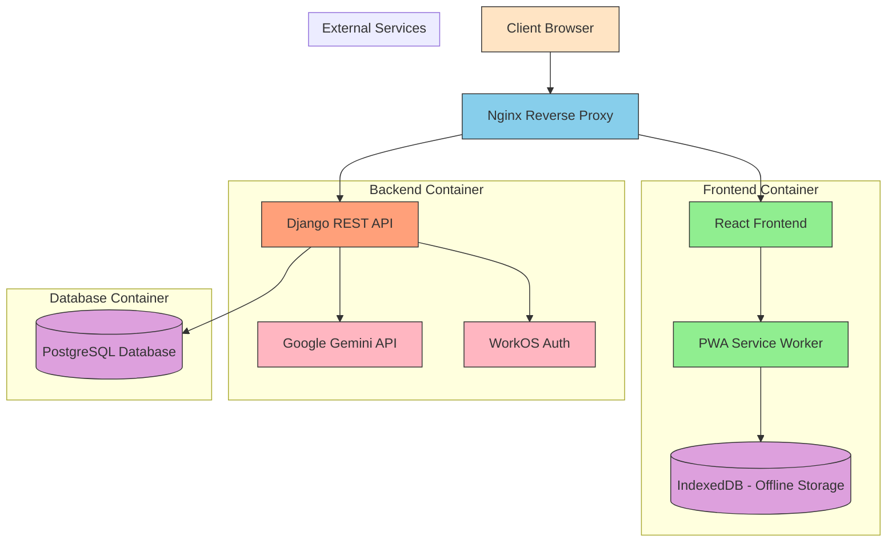

# MedhaBangla Architecture Overview

## System Architecture Diagram

## Component Descriptions

### 1. Client Browser
The user interface accessed through web browsers on desktop or mobile devices. Supports both online and offline modes through PWA capabilities.

### 2. Nginx Reverse Proxy
Handles incoming requests and routes them appropriately:
- Static files and frontend assets served directly
- API requests forwarded to Django backend
- SSL termination and security headers

### 3. React Frontend
Modern single-page application built with React and TypeScript:
- Responsive design with Tailwind CSS
- Component-based architecture
- State management with React hooks
- Routing with React Router
- PWA features for offline access

### 4. Django REST API
Backend application built with Django REST Framework:
- User authentication and management
- Quiz system with adaptive difficulty
- Digital library management
- Gamification engine
- AI integration layer
- Role-based access control

### 5. PostgreSQL Database
Primary data store for all application data:
- User profiles and authentication
- Quiz questions and attempts
- Book library metadata
- Game sessions and leaderboards
- AI chat history
- Offline notes metadata

### 6. Google Gemini API
External AI service for educational assistance:
- Personalized learning explanations
- Remedial tutoring in Bangla
- Automated note-taking
- Conceptual gap analysis

### 7. WorkOS Auth
External authentication service for Google SSO:
- Secure OAuth2 implementation
- User identity management
- Single sign-on capabilities

### 8. PWA Service Worker
Enables offline functionality:
- Caching of critical assets
- Background sync for offline actions
- Push notifications (future enhancement)

### 9. IndexedDB
Client-side storage for offline data:
- Offline notes persistence
- Cached quiz content
- User preferences and settings

## Data Flow

### User Authentication Flow
1. User accesses application through browser
2. Nginx serves login page from React frontend
3. User authenticates via WorkOS (Google SSO)
4. WorkOS returns authentication token
5. Frontend stores token and user data
6. Subsequent API requests include auth token

### Quiz Taking Flow
1. User navigates to quiz section
2. Frontend requests quizzes from Django API
3. Django filters quizzes by user's class level
4. User selects and begins quiz
5. Quiz timer starts (client-side)
6. User submits answers to Django API
7. Django validates answers and updates user points
8. Results displayed to user with accuracy breakdown

### AI Remediation Flow
1. User completes quiz with incorrect answers
2. User clicks "Improve with AI" button
3. Frontend sends incorrect answers to Django API
4. Django formats prompt for Google Gemini
5. Gemini API processes request and generates response
6. Django saves explanation and returns to frontend
7. Frontend displays remedial content in Bangla

### Offline Notes Flow
1. User interacts with AI chat or takes notes
2. User clicks "Save Offline" button
3. Frontend stores note in IndexedDB
4. Service worker attempts to sync with backend
5. If online, note is saved to Django database
6. If offline, note is queued for later sync
7. User can access notes anytime through PWA

### Gamification Flow
1. User accumulates points through quizzes
2. User attempts to access games section
3. Frontend checks point threshold (20 points)
4. If threshold met, game selection shown
5. User selects game and starts session
6. 10-minute timer begins
7. Game ends automatically after 10 minutes
8. Score submitted to Django API
9. Leaderboard updated and points awarded

## Deployment Architecture

### Development Environment
- Docker Compose orchestrates containers
- Hot reloading for frontend development
- Django development server with auto-reload
- PostgreSQL in container for data persistence

### Production Environment
- Docker Compose with production configurations
- Nginx serves static files and proxies API
- Gunicorn runs Django application
- PostgreSQL database (separate container or external)
- SSL termination at Nginx level
- Optional CDN for static assets

## Scalability Considerations

### Horizontal Scaling
- Django application can be scaled across multiple containers
- Load balancer distributes requests
- Shared database session storage
- Redis caching layer (future enhancement)

### Database Optimization
- Proper indexing on frequently queried fields
- Read replicas for reporting queries
- Connection pooling
- Query optimization for complex operations

### Caching Strategy
- Nginx caching for static assets
- Django cache framework for API responses
- Browser caching headers
- Redis or Memcached for session storage

### Monitoring and Logging
- Structured logging in Django application
- Container health checks
- Performance monitoring
- Error tracking and alerting

## Security Considerations

### Authentication Security
- JWT tokens for API authentication
- Secure token storage (HttpOnly cookies)
- Token expiration and refresh mechanisms
- Rate limiting on authentication endpoints

### Data Protection
- HTTPS encryption in transit
- Database encryption at rest (when configured)
- Input validation and sanitization
- SQL injection prevention through ORM

### Access Control
- Role-based permissions
- Object-level permissions where needed
- Audit logging for sensitive operations
- Secure password storage with hashing

## Future Enhancements

### Microservices Architecture
- Split monolithic backend into services
- Message queue for inter-service communication
- Independent scaling of components
- Technology diversity per service

### Real-time Features
- WebSocket connections for live interactions
- Real-time multiplayer gaming
- Collaborative learning features
- Instant messaging capabilities

### Advanced Analytics
- Machine learning for personalized recommendations
- Learning path optimization
- Predictive performance modeling
- Detailed teacher dashboards

### Mobile Experience
- React Native mobile application
- Native device feature integration
- Push notifications
- Offline-first mobile experience